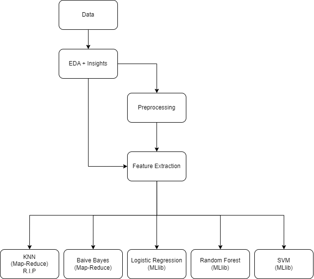

# BigTATA

## Description
Rain in Australia
The main idea is to predict whether or not it will rain tomorrow in Australia using a dataset that contains about 10 years of daily weather observations from many locations across Australia, as the dataset is quite big, we use distributed processing to build this model.

## Architecture
